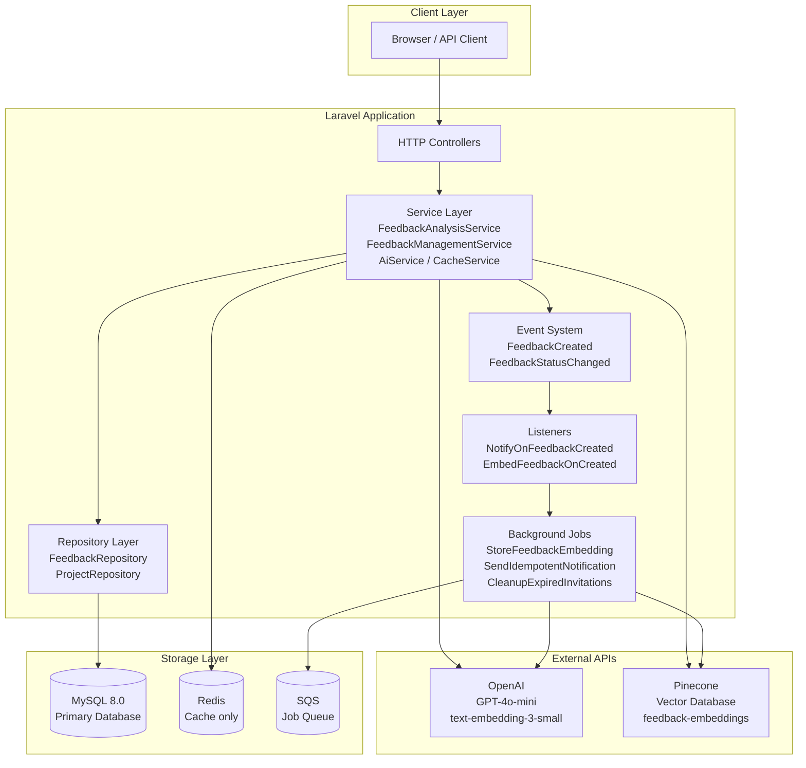
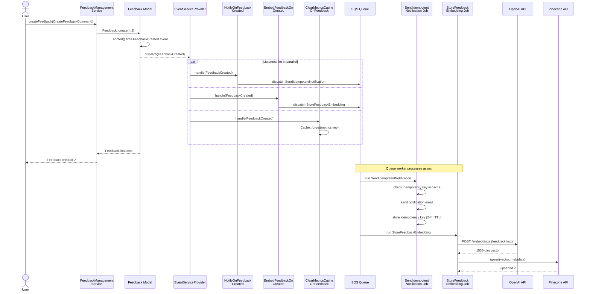
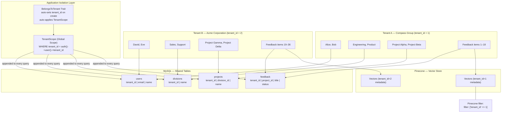
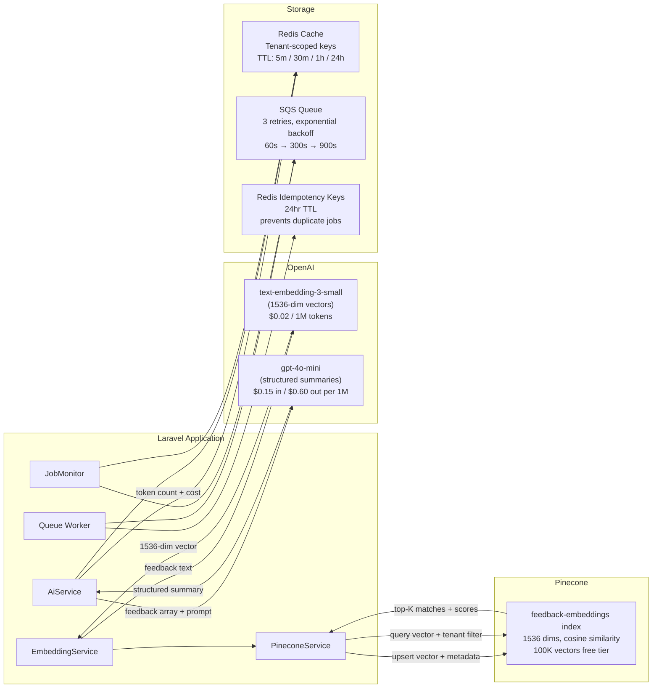
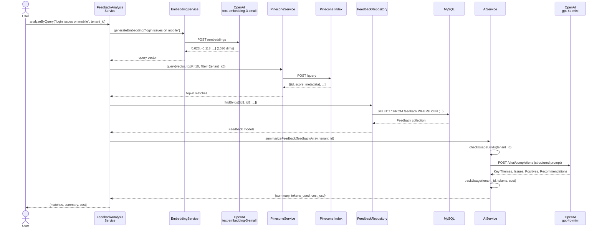
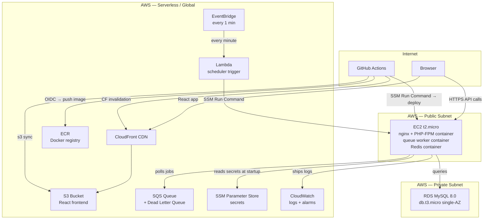

# FeedbackHub — System Diagrams

All diagrams use [Mermaid](https://mermaid.js.org/) syntax. Render in GitHub, VS Code (Mermaid Preview extension), or [mermaid.live](https://mermaid.live).

---

## 1. Architecture Overview

High-level view of all system components and how they connect.

---

## 2. Feedback Creation Data Flow

Traces exactly what happens from the moment a feedback item is created through to embedding storage.

---

## 3. Multi-Tenant Isolation Model

Shows how tenant isolation is enforced at every layer of the stack.

---

## 4. API Integration Map

Shows all external service integrations, what data flows to each, and which internal components own the integration.

---

## 5. Complete Semantic Search Pipeline

End-to-end flow when a user queries for semantically similar feedback.

---

## 6. AWS Deployment Architecture (Month 8)

Production deployment using AWS free tier services.

